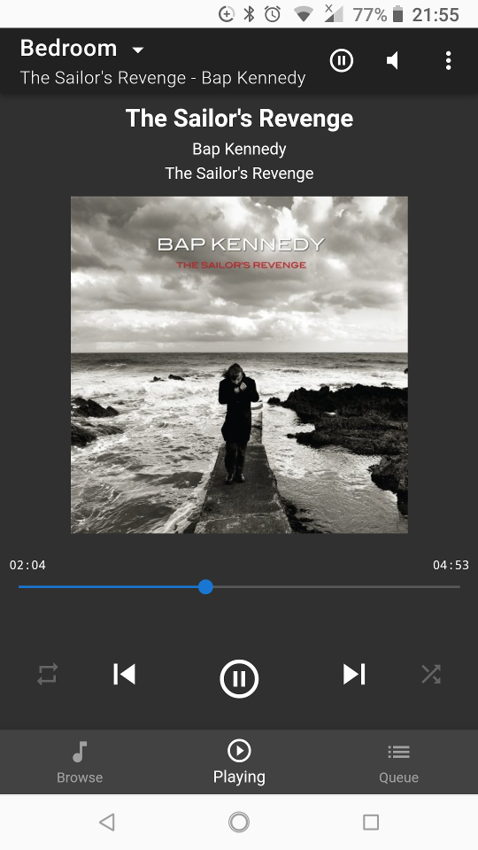
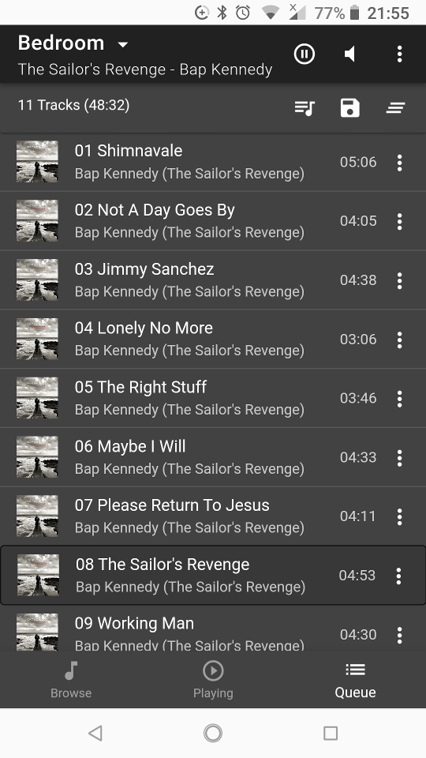

# Material skin for SlimServer (Logitech Media Server)






## Features

1. Mobile and desktop layouts
2. Browse local library - Artists, Album Artists (if not set for single list),
   Genres, Playlists, Years, Composers, etc.
3. Add random albums of artist, genre, or year
4. Browse Radio, Favourites, and Apps
5. Add, delete, and rename favourites
6. Add, delete, and rename playlists
7. Now playing
8. Play queue with drag'n'drop editing
9. UI settings; dark theme, album sort, auto scroll play queue
10. Player settings; crossfade, replay gain, don't stop the music, alarms
11. Sync support
12. Info dialog to show stats, and re-scan music
13. Manage players; control volume, play/pause, show current track
14. Group player control; add, edit, delete
15. Pin apps, etc, to main screen
16. Swipe left/right to change views with mobile layout

## Installation

Using LMS GUI:

1. Open the LMS web page (e.g. `http://localhost:9000`)
2. Click on Settings
3. Select the Plugins tab
4. At bottom of the page add the repo URL: `https://raw.githubusercontent.com/CDrummond/lms-material/master/public.xml`
5. Install the plugin and enable as usual

Manually:

Copy (or symlink) the ```MaterialSkin``` directory into the server's `Plugin`
directory.


## Usage

1. Access the skin through `http://<yourserver>:9000/material/`
2. Select "Add to Home screen" on your device, if supported.


### Selecting mobile or desktop

The skin should automatically choose mobile or desktop layouts, but you may also
force one or the other.

1. `http://<yourserver>:9000/material/mobile` will force mobile layout
2. `http://<yourserver>:9000/material/desktop` will force desktop layout


## Testing

The skin may be installed on a machine separate to LMS. Currently this
is how it's developed. e.g.

1. cd in the `material` folder
2. Start python's simple HTTP server - e.g. `python -m SimpleHTTPServer`
3. Access on localhost via `http://localhost:8000/mobile.html?lms=192.168.0.1`
   or `http://localhost:8000/desktop.html?lms=192.168.0.1` (replace
   `192.168.0.1` with the IP address of the LMS server)

